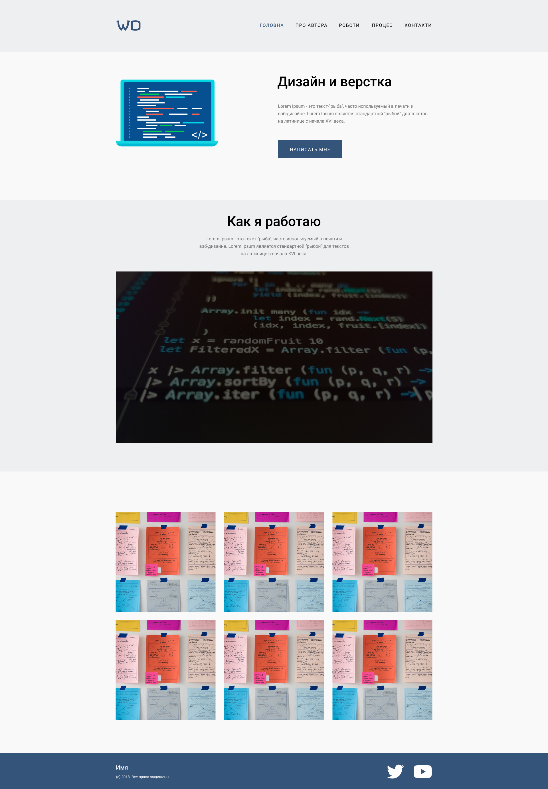

# Виконати верстку макету

# Технічне завдання

# 1) Розкладку блоків зробити за допомогою float
# 2) Відступи допускається розбіжність від макетних
# 3) У всіх логічних блоків має бути заголовок, навіть якщо його немає в макеті
# 4) Шрифт макета Roboto, але поки що ставимо Tahoma
